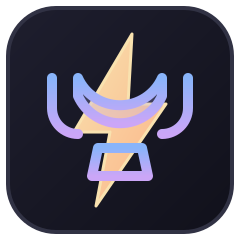
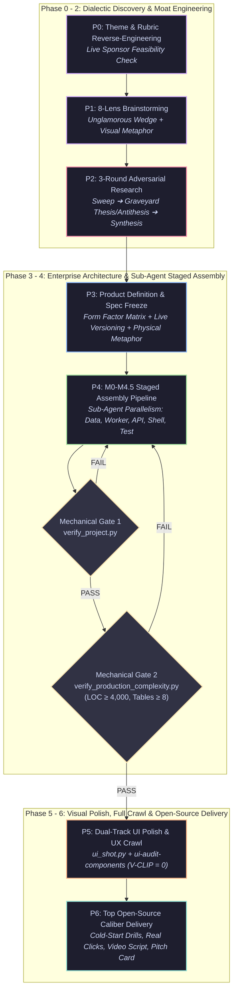

<div align="center">



# **hack2win**

### The Autonomous Production-Grade Hackathon & Full-Stack MVP Orchestration Engine

*Transform AI Coding Agents into Elite Technical Leads & Founding Engineers.*
*From Three-Round Dialectic Research to 10k+ LOC Clean Architecture, Unbounded 3D/Voxel Interfaces, and Dual Mechanical Verification Gates.*

<p>
  <a href="#-the-problem-toy-demo-syndrome">The Problem</a> •
  <a href="#-8-core-superpowers">Superpowers</a> •
  <a href="#-system-architecture">Architecture</a> •
  <a href="#-showcase-gallery">Showcase</a> •
  <a href="#-quick-start">Quick Start</a> •
  <a href="#-the-14-reference-manuals">Manuals</a> •
  <a href="#-verification-cli-suite">CLI Suite</a> •
  <a href="#-battle-tested-track-record">Benchmarks</a>
</p>

<p>
  <a href="README.md"><b>English</b></a> | <a href="README_zh.md"><b>中文文档</b></a>
</p>

---

[](LICENSE)
[](https://github.com/alvinluo-tech/hack2win/releases)
[](https://www.python.org/)
[](https://nodejs.org/)
[](https://www.typescriptlang.org/)
[](references/09-tech-architecture.md)
[](references/12-winning-ui-patterns.md)
[](scripts/)
[](https://github.com/alvinluo-tech/hack2win/pulls)

</div>

---

## ⚡ The Problem: "Toy Demo Syndrome"

When commanded to *"build a hackathon project"* or *"scaffold a full-stack MVP"*, vanilla AI coding agents almost universally collapse into **Toy Demo Syndrome**:

```
What Vanilla AI Agents Deliver              What Hackathon Judges & Production Actually Demand
┌───────────────────────────────────────┐  ┌────────────────────────────────────────────────────────┐
│ ❌ 1-2 Flat SQLite Tables (No Tenancy)│  │ ✅ Multi-Tenant RBAC + 10-15+ Normalized Schema Models │
│ ❌ Monolithic 800-LOC Single File     │  │ ✅ Clean Architecture (Router ➔ DTO ➔ Service ➔ Repo)  │
│ ❌ Synchronous Blocking HTTP Handlers │vs│ ✅ Asynchronous Background Task Queue (Redis / Worker) │
│ ❌ Generic Bootstrap / Card Webpages  │  │ ✅ Immersive 3D Voxel Worlds / Infinite Canvases / OS  │
│ ❌ Hardcoded Fake Metrics in Animations│ │ ✅ State-Driven Visual Invariant (Reactive Domain Events)│
│ ❌ Fragile Shallow Tests (toBeVisible)│  │ ✅ State-Mutation Delta Tests (ΔState = Action(State)) │
│ ❌ Zero Verification of Real Clicks   │  │ ✅ Dual Mechanical Gate CLIs + Component-Level Audits  │
└───────────────────────────────────────┘  └────────────────────────────────────────────────────────┘
```

**`hack2win` bridges this chasm.** It is not an ordinary collection of prompts; it is a **rigorous orchestrator operating system (OS)** that forces AI agents to think, architect, assemble, audit, and iterate like battle-tested founding engineers and seasoned hackathon champions.

---

## 🚀 8 Core Superpowers

### 1. 🔍 Three-Round Dialectic Adversarial Research
Never accept the first idea. The agent runs a structured three-phase pipeline:
1. **Sweep**: Automated landscape discovery via Exa semantic searches.
2. **Red-Team Graveyard & Thesis vs. Antithesis**: Deep-dives into failed projects, incumbent weaknesses, and constructs a brutal dialectical matrix.
3. **Synthesis**: Pinpoints an asymmetric, unglamorous wedge (*The Unglamorous Wedge*) with defensible moat.

### 2. 📱 Multi-Platform Form Factor Engine
Breaks free from the "everything is a SaaS dashboard" trap. The agent systematically evaluates whether the problem is best solved via:
- **Web App**: Next.js 15/16+ App Router, React 19, Tailwind v4.
- **Cross-Platform Desktop**: Tauri 2+ (Rust) for low-latency system-level tools.
- **Mobile Native**: Expo / React Native.
- **Browser Extension**: WXT / Plasmo with Shadow DOM injection.
- **Hybrid Multi-Screen**: Connected IoT / Mobile scanner + Web monitor.

### 3. 🏛️ Clean Architecture & Enterprise Assembly (4,000 - 25,000+ LOC)
Structured decomposition across **8 core enterprise subsystems**:
- Multi-Tenancy, Organization & RBAC permissions.
- Domain State Machine with strictly guarded lifecycle transitions.
- Background Worker Queue (Redis + ARQ / Taskiq) for heavy operations.
- Relational Data Engine (SQLAlchemy 2.0 async + PostgreSQL / SQLite WAL with 8-15+ tables).
- API Gateway with correlation-IDs, unified envelope, and rate limiting.
- Enterprise Layout Shell with collapsible sidebar, dynamic breadcrumbs, and Command Palette (`Cmd+K`).
- Deep workbenches: TanStack DataTable (multi-column sort, facet chips, column visibility, bulk actions) and Form Wizard.
- Automated test suites (pytest ≥ 15, Playwright E2E, Docker Compose 5-service cluster).

### 4. 🎮 Unbounded 4D Generative Interface Space
UI is an immersive stage, not a spreadsheet. The agent extracts the physical metaphor of the core domain:
- **2D Pixel Worlds**: Smallville-style voxel towns (Phaser / Canvas) for multi-agent simulation.
- **3D Spatial Digital Twins**: Three.js / React Three Fiber interactive voxel galaxies.
- **Retro OS & Cyberpunk Terminals**: Draggable multi-window desktop (WinBox / 98.css) with CRT scanline shaders.
- **Infinite Graph Canvases**: React Flow / Force-directed graphs with physics-based nodes.
- **High-Density Cockpits**: Sleek dark-modern dashboards (`#09090b` matte + neon accents + monospace chips).
- **User-Intent Supremacy**: If you specify a style (e.g. *"make it look like Stardew Valley"*), the agent **100% obeys and elevates** it with authentic period details (8-bit Web Audio, pixel fonts, tile collision).

### 5. 🎯 State-Driven Visual Invariant
**Animations must never lie.** Visual flare (such as "+120 cr" floating numbers, particle bursts, and wallet balance badges) is mathematically bound to backend domain events. If a job earns ¥131, the floating particle must display exactly "+131", and the header balance chip must mutate accordingly.

### 6. 🛡️ Dual Mechanical Verification Gates
No self-reported completions. AI must pass zero-dependency cross-platform automated CLI audits:
- **`verify_project.py`**: Enforces dual-service structure, lockfiles, `.env.example`, ORM migrations, error envelopes, and zero TODO/mock detectors.
- **`verify_production_complexity.py`**: Enforces Complexity Floor (LOC ≥ 4,000, Tables ≥ 8, Endpoints ≥ 16, Components ≥ 15, Worker presence). Failure exits with code `1`.

### 7. 📸 Full-Viewport UX Crawl & Component Clipping Audit
Eliminates clipped text (such as `"20 / page"` truncated vertically in custom dropdowns) and runtime exceptions:
- **`ui_shot.py`**: Multi-viewport automated captures (Desktop 1440px + Mobile 390px) with `-ExpectText` DOM assertions to prevent capturing error pages.
- **`ui-audit-components.mjs`**: Element-by-element DOM audit checking for `V-CLIP` (scrollHeight > clientHeight) and `TINY` click targets (<20px).
- Enforces mature headless component libraries (Radix UI / shadcn Portal Select) for all composite inputs.

### 8. 🧩 Dynamic 16+ Specialized Skill Orchestration
As a meta-orchestrator, `hack2win` does not reinvent specialized wheels. It dynamically queries and coordinates specialized tools:
- Architecture: `codebase-design`, `domain-modeling`, `setup-ts-deep-modules`
- Testing: `tdd`, `typescript-e2e-testing`, `ai-regression-testing`
- Desktop: `tauri`, `tauri-development`
- UI Taste: `design-taste-frontend`, `glassmorphism`
- Inspection: `code-review`, `diagnosing-bugs`

---

## 🏗️ System Architecture



---

## 🏆 Showcase Gallery: Real Production MVPs Built with `hack2win`

The following full-stack projects were generated completely autonomously by AI agents guided by `hack2win`, and vetted by independent adversarial judges:

### 1. 🏙️ AgentForge — 3D Voxel Multi-Agent Economy & Sandboxed City
> **Hackathon**: AI Agents November Hackathon (r/AI_Agents & Redis)  
> **Score**: **87 / 100 ("Close to Production" — Highest Benchmark)**  
> **UI Metaphor**: 3D Procedural Voxel SimCity (React Three Fiber + Drei) with day/night 120s cycles, walking agent NPCs, particle gold coin explosions, and fly-to cameras.

```
┌────────────────────────────────────────────────────────────────────────────────────────┐
│ [3D VOXEL METROPOLIS]                                    [ENTERPRISE HUD LAYER]        │
│    ☁️                                                   - Real-Time Credits Ledger      │
│          🏢 Client Tower A (Order Incoming!)            - Active Workers: 4 Online     │
│                 \                                       - 3-Step Order Wizard          │
│                  🚶 Voxel Agent (Walking to Deliver)    - Invariant: Balance mutates    │
│                 /                                         strictly on payout event     │
│          🏦 Treasury & Escrow Vault                                                    │
└────────────────────────────────────────────────────────────────────────────────────────┘
```
- **Scale**: **6,008 LOC** | 12 Normalized DB Tables | 25 REST Endpoints | 27 Components (13 in 3D, 14 HUD).
- **Core Engineering**: Full escrow-to-payout state machine, background worker queue, zero external 3D asset dependencies (100% procedural geometry).

### 2. ⚡ AgentPulse — Enterprise AI Agent Observability & Deterministic Linter
> **Hackathon**: Open Agent Hackathon 2026 (genai.works)  
> **Score**: **82 / 100 ("Production Grade Passed" — 0 Fabrications under Adversarial Stress-Test)**  
> **UI Metaphor**: High-Density Linear-Style Dark Cockpit with execution waterfall graphs, real-time KPI pulse bar, and TanStack DataTable.

- **Scale**: **8,342 LOC** (3,758 FE / 4,584 BE) | 13 DB Tables | 38 API Endpoints | 26 Components | 35 Automated Pytest Suites.
- **Core Engineering**: 12 deterministic linter engines (infinite loop detector, latency degradation, cascading tool failure), background worker, multi-tenant RBAC.

### 3. 🔍 ClaimLens — Local-First Fact-Checking & WebGPU NLI Pipeline
> **Hackathon**: Nebius x NVIDIA Global AI Hackathon (Devpost)  
> **Score**: **79 / 100 ("Silver Finalist")**  
> **UI Metaphor**: Dual-Pane Split Diff Inspector with verified live Wikipedia REST retrieval and client-side ONNX NLI inference.

- **Core Engineering**: Zero-key local inference, verified against transformers.js edge-case bugs, 100% byte-reproducible verification receipts.

---

## 📦 Quick Start

### 1. Installation

Install `hack2win` directly into your agent's skill directory. Compatible with **Claude Code**, **OpenClaw**, **Cursor**, **Windsurf**, **ZCode**, or any custom agent architecture:

```bash
# Standard universal skills directory (macOS, Linux, Windows)
git clone https://github.com/alvinluo-tech/hack2win.git ~/.agents/skills/hack2win

# Or for ZCode project workspace
git clone https://github.com/alvinluo-tech/hack2win.git ~/.zcode/skills/hack2win
```

### 2. Verify Your Environment

Run the zero-dependency cross-platform diagnostic suite:

```bash
# Universal Python 3 (macOS / Linux / Windows)
python ~/.agents/skills/hack2win/scripts/list_skills.py

# Or on Windows PowerShell
powershell -File ~/.agents/skills/hack2win/scripts/list-skills.ps1
```

### 3. Command Your Agent

Prompt your AI coding agent with your mission:

```text
"I am competing in [Hackathon Name].
Use the hack2win skill to lead the entire project from adversarial research,
architecture blueprinting, and full-stack assembly to verification and submission."
```

#### Giving Creative Direction:
```text
"I want to build a decentralized code audit platform.
I want the UI to be a 3D interactive voxel terminal using React Three Fiber.
Follow hack2win to build a production-grade FastAPI backend with background workers,
and enforce dual mechanical verification gates before delivery."
```

---

## 📚 The 14 Reference Manuals

`hack2win` is driven by a comprehensive, modular knowledge base. Every manual is versioned, relative, and completely self-contained:

<details open>
<summary><b>📖 Comprehensive Manual Index</b></summary>

| Ref | Document | Domain & Engineering Focus |
|---|---|---|
| `00` | [`00-theme-decode.md`](references/00-theme-decode.md) | Sponsor intent reverse-engineering, rubric weighting, and live feasibility pre-flight checks. |
| `01` | [`01-brainstorm.md`](references/01-brainstorm.md) | 8-lens brainstorming, asymmetric wedge selection, and avoiding crowded red-ocean wrappers. |
| `02` | [`02-market-research.md`](references/02-market-research.md) | 3-round dialectic adversarial research (Sweep ➔ Graveyard ➔ Synthesis), automated link-checker. |
| `03` | [`03-product-definition.md`](references/03-product-definition.md) | Form factor matrix (Web/Desktop/Mobile/Extension), package registry probes, and physical metaphor mapping. |
| `04` | [`04-build-playbook.md`](references/04-build-playbook.md) | M0-M4.5 staged assembly, state-mutation delta tests, sponsor live proof, and cold-start drills. |
| `05` | [`05-polish.md`](references/05-polish.md) | UI visual acceptance loop, whole-app UX crawl, component clipping audit (`ui-audit-components`). |
| `06` | [`06-pitch-submit.md`](references/06-pitch-submit.md) | 3-minute pitch structure, live generation moment, Q&A battlecard, and submission compliance checklist. |
| `07` | [`07-judging-rubrics.md`](references/07-judging-rubrics.md) | Official scoring criteria analysis across Devpost, MLH, Google Cloud, ETHGlobal, and Alibaba. |
| `08` | [`08-production-standard.md`](references/08-production-standard.md) | Complexity Floor (LOC ≥ 4,000, 8+ tables, 16+ endpoints, async worker), anti-toy demo rules. |
| `09` | [`09-tech-architecture.md`](references/09-tech-architecture.md) | Clean Architecture & DDD, deep modules (`dependency-cruiser`), single-file LOC budgets. |
| `10` | [`10-orchestration.md`](references/10-orchestration.md) | Meta-orchestrator registry (16 specialized skills: `codebase-design`, `tdd`, `tauri`, `pre-commit`...). |
| `11` | [`11-enterprise-complexity-architecture.md`](references/11-enterprise-complexity-architecture.md) | 8-subsystem breakdown, sub-agent parallelization, and Top Open-Source Caliber delivery standards. |
| `12` | [`12-winning-ui-patterns.md`](references/12-winning-ui-patterns.md) | Reverse-engineering real hackathon winners (*PolyAgents*, *AudiThor*, *Voodo*, *Storylayer*), 4D interface space. |
| `13` | [`13-winning-knowledge.md`](references/13-winning-knowledge.md) | 30 verified case studies and winner post-mortems from top hackathons. |

</details>

---

## 🛠️ Verification CLI Suite

`hack2win` includes native, zero-dependency CLI verification scripts that run identically across **Linux, macOS, and Windows**:

```bash
# 1. Structural & Contract Verification (17 checks)
python scripts/verify_project.py --project-path ./app

# 2. Production Complexity Audit (LOC, tables, endpoints, components, workers)
python scripts/verify_production_complexity.py --project-path ./app --min-loc 4000

# 3. Cross-Platform Automated Screenshot with DOM Assertion
python scripts/ui_shot.py --url "http://localhost:3000" --out-dir "./iterations/round-1" --expect-text "AgentPulse"

# 4. Local Skills Inventory & Orchestration Matrix
python scripts/list_skills.py
```

*(Windows developers can also execute the native `.ps1` equivalents located in `scripts/`).*

---

## 📊 Battle-Tested Benchmark Track Record

`hack2win` is developed through continuous live simulations across major global hackathons, audited by independent adversarial judges who perform **clean-slate database cold-starts, state-machine probing, and byte-level payload verifications**:

```
Live Simulation Score Progression (R1 ➔ R12)
─────────────────────────────────────────────────────────────────────────────
[R1 - R3]  Initial Baselines (71 - 80)        ➔ Established Demo-First & Truth Rules
[R4 - R6]  Resiliency & Reliability (76 - 81) ➔ Invented Cold-Start & Asset Probes
[R7 - R8]  Full-Stack & Orchestration (85 - 86)➔ Formalized Clean Architecture
[R9]       Visual Iteration Loop (90)         ➔ Fixed Invisible Charts via Visual Loops
[R10]      PAYATHON Intermediate (84)         ➔ Proved Escrow & Refund State Machine
[R11]      Enterprise Scale (82 / 100)        ➔ 8,342 LOC, 13 Tables, 38 Endpoints, 35 Tests
[R12]      3D Voxel World (87 / 100)          ➔ React Three Fiber 3D City + Async Worker
─────────────────────────────────────────────────────────────────────────────
```

---

## 🤝 Contributing & Community

We are building the future of autonomous, high-caliber software engineering. We welcome PRs, issues, and discussions!

1. Fork the repository.
2. Create your branch (`git checkout -b feature/NewPattern`).
3. Commit your changes (`git commit -m 'feat: add WebGPU spatial canvas pattern'`).
4. Push to branch (`git push origin feature/NewPattern`).
5. Open a Pull Request.

---

## 📄 License

Distributed under the **MIT License**. See [`LICENSE`](LICENSE) for complete details.

<div align="center">
  <sub>Engineered by <a href="https://github.com/alvinluo-tech">Alvin Luo</a>. If hack2win helped your agent win a hackathon, consider giving us a ⭐️!</sub>
</div>
