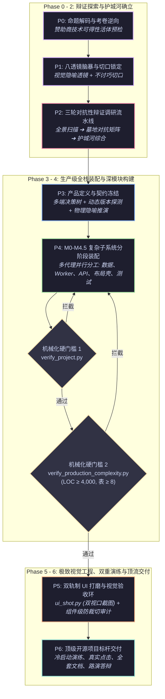

<div align="center">

```
██╗  ██╗ █████╗  ██████╗██╗  ██╗██████╗ ██╗    ██╗██╗███╗   ██╗
██║  ██║██╔══██╗██╔════╝██║ ██╔╝╚════██╗██║    ██║██║████╗  ██║
███████║███████║██║     █████╔╝  █████╔╝██║ █╗ ██║██║██╔██╗ ██║
██╔══██║██╔══██║██║     ██╔═██╗ ██╔═══╝ ██║███╗██║██║██║╚██╗██║
██║  ██║██║  ██║╚██████╗██║  ██╗███████╗╚███╔███╔╝██║██║ ╚████║
╚═╝  ╚═╝╚═╝  ╚═╝ ╚═════╝╚═╝  ╚═╝╚══════╝ ╚══╝╚══╝ ╚═╝╚═╝  ╚═══╝
```

### **全自主黑客松夺奖与万行级生产全栈工程总控引擎**

*将 AI 编程智能体升级为具备深层架构与商业洞察的首席架构师与联合创始人。*  
*从三轮对抗性辩证调研，到万行级 Clean Architecture、沉浸式 3D / 像素世界界面隐喻、以及双重机械化质量硬门槛。*

<p align="center">
  <a href="#-核心痛点彻底终结玩具-demo-综合征">核心痛点</a> •
  <a href="#-八大工业级超能力">八大超能力</a> •
  <a href="#-系统架构全景">系统架构</a> •
  <a href="#-实战展示画廊showcase">实战画廊</a> •
  <a href="#-极速起步">极速起步</a> •
  <a href="#-14-篇模块化知识库">知识体系</a> •
  <a href="#-跨平台自动化验证套件">CLI 工具链</a> •
  <a href="#-对抗性实测基准演进">演进历程</a>
</p>

<p align="center">
  <a href="README.md"><b>English</b></a> | <a href="README_zh.md"><b>中文文档</b></a>
</p>

---

[](LICENSE)
[](https://github.com/alvinluo-tech/hack2win/releases)
[](https://www.python.org/)
[](https://nodejs.org/)
[](https://www.typescriptlang.org/)
[](references/09-tech-architecture.md)
[](references/12-winning-ui-patterns.md)
[](scripts/)
[](https://github.com/alvinluo-tech/hack2win/pulls)

</div>

---

## ⚡ 核心痛点：彻底终结“玩具 Demo 综合征”

当开发者指令原生 AI “参加黑客松”或“从 0 到 1 做个原型”时，原生 AI 几乎必然陷入**浅薄玩具泥潭**：

```
原生 AI 产出的常见“玩具代码”             现代工业级大赛与真实生产落地标准
┌───────────────────────────────┐     ┌────────────────────────────────────────────────────────┐
│ ❌ 1-2 张单表、无租户、无外键 │     │ ✅ 多租户 RBAC + 10-15+ 张规范化关系实体               │
│ ❌ 上千行代码堆在一个单文件里 │     │ ✅ Clean Architecture (Router → DTO → Service → Repo)  │
│ ❌ 重计算与外部 API 同步阻塞  │ vs  │ ✅ 异步任务队列与后台 Worker (Redis / DB Tasks)        │
│ ❌ 千篇一律的单调管理后台卡片 │     │ ✅ 3D 体素世界 / 物理拓扑画布 / 复古 OS 赛博终端       │
│ ❌ 动效金额写死、动画与数据脱节│    │ ✅ 单向真值源投影律 (动效纯粹消费后端领域事件流)       │
│ ❌ 浅薄的 toBeVisible() 弱测试│     │ ✅ 状态跃迁增量断言 (严格校验 ΔState = Action(State))  │
│ ❌ 绝不验证界面是否真实可点击 │     │ ✅ 双重机械化门禁 CLI + 组件级防裁切与真实点击审计     │
└───────────────────────────────┘     └────────────────────────────────────────────────────────┘
```

**`hack2win` 彻底跨越了这道鸿沟。** 它不是简单的提示词集合，而是一套**工程化的总控操作系统 (Orchestrator OS)**，强制驱动 AI 扮演经验丰富的资深技术联合创始人与首席架构师。

---

## 🚀 八大工业级超能力

### 1. 🔍 三轮对抗性辩证调研流水线 (3-Round Dialectic Research)
拒绝任何拍脑袋。智能体执行严格的三阶段调研闭环：
1. **全景广度扫描 (Sweep)**：调用 Exa 语义检索，摸清现有产品生态分布；
2. **红队墓地压力测试与死亡对抗矩阵 (Graveyard Red-Team)**：深挖历史失败项目与现有巨头缺陷，建立 Thesis vs. Antithesis 辩证对抗矩阵；
3. **升维综合 (Synthesis)**：锁定不讨巧却痛感极强的大奖级切口 (*The Unglamorous Wedge*)，确立技术壁垒。

### 2. 📱 多端呈现形式决策树 (Multi-Platform Form Factor Engine)
破除“一切产品都是浏览器网页”的狭隘认知，科学评估问题形态：
- **Web 应用**：Next.js 15/16+ (App Router, React 19, Tailwind v4)；
- **跨平台桌面客户端**：Tauri 2+ (Rust)，实现超低内存占用与系统级硬件控制；
- **移动端**：Expo / React Native 原生跨端体验；
- **浏览器扩展**：WXT / Plasmo 深度注入网页宿主；
- **混合协同**：扫码移动端 + 大屏 3D 控制台。

### 3. 🏛️ 万行级 Clean Architecture 与企业级工程装配 (4,000 - 25,000+ LOC)
结构化解构并装配 **8 大企业级子系统**：
- 多租户组织隔离与 RBAC 权限守卫；
- 领域状态机与不可逆业务流转控制；
- 异步任务队列（Redis + ARQ / Taskiq）解耦重计算；
- 关系型数据底座（SQLAlchemy 2.0 异步 + PostgreSQL / SQLite WAL，8-15+ 实体表）；
- 统一 API 网关（全链路 Correlation-ID、统一响应 Envelope、速率限制）；
- 企业级 Layout Shell（折叠侧边栏、动态面包屑、全局指令面板 `Cmd+K`）；
- 深度数据工作台（TanStack DataTable 高级表格、Form Wizard 分阶段向导）；
- 自动化测试金字塔（pytest ≥ 15、Playwright E2E、Docker Compose 5 容器集群）。

### 4. 🎮 开放式 4D 生成界面空间与非标世界观 (4D Generative Interface Space)
界面是沉浸式的交互舞台，拒绝模板化后台。根据领域推演物理心智隐喻：
- **2D 像素世界**：Smallville 风格瓦片小镇 (Phaser / Canvas)，生动模拟多智能体社交协同；
- **3D 空间数字孪生**：Three.js / React Three Fiber 程序化体素星系与数字城市；
- **复古 OS 与赛博终端**：WinBox 多层自由拖拽窗口、98.css、CRT 扫描线着色器微特效；
- **无限拓扑画布**：React Flow / 力导向物理节点流；
- **高密度极客驾驶舱**：现代暗黑风 (`#09090b` 哑光黑 + 霓虹点缀 + 等宽数据芯片)；
- **用户风格绝对优先原则 (User-Intent Supremacy)**：若用户指定了特定风格（如“做成类似星露谷物语的像素小镇”），智能体 **100% 遵从并专业升维**，配齐 8-bit Web Audio、像素字体、瓦片碰撞等专业细节。

### 5. 🎯 单向真值源投影律 (State-Driven Visual Invariant)
**界面动效绝不撒谎。** 所有 3D 粒子爆发、浮动数字（如“+131 cr”）、顶栏余额均作为后端领域事件流的纯函数投影。如果任务结算赚得 ¥131，前端浮字必须精确显示 "+131"，顶部余额徽章必须同步累加，消除任何动效与业务数据脱节的穿帮。

### 6. 🛡️ 双重机械化门禁自动化审计 (Dual Mechanical CLI Gates)
拒绝口头汇报“我做完了”。AI 必须通过零依赖跨平台 CLI 自动化审计脚本：
- **`verify_project.py`**：校验前后端分层、依赖锁定、.env 模板、数据库迁移、错误信封与零 TODO/Mock 探测；
- **`verify_production_complexity.py`**：审计复杂度底线（LOC ≥ 4,000、表 ≥ 8、端点 ≥ 16、组件 ≥ 15、Worker 存在性），未达标直接退出码 1 拦截。

### 7. 📸 全视口 UX 遍历与组件级防裁切审计
彻底消灭显示不全（如分页下拉框中“20 条/页”文字被垂直切断）与点击运行时崩溃：
- **`ui_shot.py`**：自动化双视口截图（桌面 1440px + 移动端 390px），内建 `-ExpectText` DOM 断言防止截图错误页；
- **`ui-audit-components.mjs`**：逐元素遍历检测 `V-CLIP`（scrollHeight > clientHeight 垂直裁切）与 `TINY`（点击热区 <20px）；
- 强制复合控件（分页下拉、级联筛选）使用成熟无头组件库（Radix UI / shadcn Portal Select），避免原生 `<select>` 矮容器裁切通病。

### 8. 🧩 16+ 领域技能动态编排网络 (Specialized Skill Orchestration)
作为总控层，`hack2win` 不重复造轮子，按需动态检索并调度专业领域技能：
- 架构设计：`codebase-design`、`domain-modeling`、`setup-ts-deep-modules`
- 质量测试：`tdd`、`typescript-e2e-testing`、`ai-regression-testing`
- 跨端桌面：`tauri`、`tauri-development`
- 设计审美：`design-taste-frontend`、`glassmorphism`
- 代码体检：`code-review`、`diagnosing-bugs`

---

## 🏗️ 系统架构全景



---

## 🏆 实战展示画廊 (Showcase)

以下全栈项目由 AI 在 `hack2win` 驱动下完全自主完成，并经受了独立对抗性评委的破坏性测试与复证：

### 1. 🏙️ AgentForge — 3D 体素多智能体经济体微缩沙盘
> **实战比赛**：AI Agents November Hackathon (r/AI_Agents 社区 × Redis 赞助)  
> **评委评分**：**87 / 100（“接近生产” — 系列最高分，零注水零造假）**  
> **UI 视觉隐喻**：React Three Fiber 3D 程序化体素城市，包含 120 秒昼夜光影循环、体素小人行走接单、完成订单金色粒子爆发、相机平滑飞跃运镜。

```
┌────────────────────────────────────────────────────────────────────────────────────────┐
│ [3D 体素微缩沙盘城市]                                      [企业级 HUD 交互层]         │
│    ☁️ 飘动云层                                            - 实时企业资产脉搏看板        │
│          🏢 客户大楼 A (新任务挂单!)                      - 活跃 Worker: 4 实例在线    │
│                 \                                         - 3 步工单发布向导           │
│                  🚶 体素小人 (自主跑动接单交付)            - 真值投影: 余额仅在收益事件 │
│                 /                                           发生时精确跳动             │
│          🏦 资金托管中心与金币金库                                                     │
└────────────────────────────────────────────────────────────────────────────────────────┘
```
- **工程规模**：**6,008 行有效源码** | 12 张规范数据表 | 25 个 REST 端点 | 27 个组件（13 个 3D 组件，14 个 HUD 组件）。
- **底层架构**：资金托管与分佣状态机、异步任务队列租约消费、程序化 3D 几何（零外部模型资产依赖）。

### 2. ⚡ AgentPulse — 万行级企业 AI Agent 可观测性与死循环断言诊断平台
> **实战比赛**：Open Agent Hackathon 2026 (genai.works)  
> **评委评分**：**82 / 100（“生产级达标” — 经受删库级压力测试，零虚假规模）**  
> **UI 视觉隐喻**：Linear 风格高密度暗黑控制台，包含执行瀑布图、实时 KPI 脉搏条、TanStack DataTable 高级表格。

- **工程规模**：**8,342 行有效源码**（前端 3,758 / 后端 4,584）| 13 张规范表 | 38 个 API 端点 | 26 个前端组件 | 35 条自动化 pytest 测试。
- **底层架构**：12 项确定性死循环/延迟/Token 尖峰检测器、异步 Worker 任务池、多租户 RBAC 与操作审计。

### 3. 🔍 ClaimLens — 本地优先端侧 NLI 事实核查流水线
> **实战比赛**：Nebius x NVIDIA Global AI Hackathon (Devpost)  
> **评委评分**：**79 / 100（“银奖候选”）**  
> **UI 视觉隐喻**：双栏差异透镜（Split Diff Inspector），包含实时 Wikipedia 检索与端侧 ONNX 模型推演。

- **底层架构**：纯客户端 WebGPU / WASM 离线推理，绕过 upstream transformers.js 底层 bug，输出可独立复证的密码学级别验证收据。

---

## 📦 极速起步

### 1. 安装到智能体环境

将 `hack2win` 克隆至你的智能体技能目录，原生兼容 **Claude Code**、**OpenClaw**、**Cursor**、**Windsurf**、**ZCode** 或自定义 Agent 框架：

```bash
# 通用跨平台技能目录 (macOS / Linux / Windows)
git clone https://github.com/alvinluo-tech/hack2win.git ~/.agents/skills/hack2win

# 或 ZCode 专用项目空间
git clone https://github.com/alvinluo-tech/hack2win.git ~/.zcode/skills/hack2win
```

### 2. 环境健康体检

运行零依赖跨平台诊断脚本：

```bash
# 通用 Python 3 (macOS / Linux / Windows)
python ~/.agents/skills/hack2win/scripts/list_skills.py

# 或 Windows PowerShell
powershell -File ~/.agents/skills/hack2win/scripts/list-skills.ps1
```

### 3. 下达任务指令

直接在会话中给你的 AI 编程助手下达指令：

```text
"我要参加 [比赛名称/主题]。
请使用 hack2win 技能作为总控，带我从三轮对抗性调研、架构蓝图设计，
一直到万行级全栈工程装配、视觉验收与合规提交全流程推进。"
```

#### 指定特定设计风格（用户意志第一）：
```text
"我要做一个去中心化代码审计平台。
我希望界面是基于 React Three Fiber 的 3D 可交互体素终端，带有日夜光影动画。
请遵循 hack2win 规范，在下方搭建工业级的 FastAPI 后端与异步任务队列，
并在交付前跑通双重机械化复杂度门禁。"
```

---

## 📚 14 篇模块化知识库

`hack2win` 拥有严密的模块化参考手册树，全部基于相对路径，**100% 自包含**：

<details open>
<summary><b>📖 展开查阅 14 篇参考手册索引</b></summary>

| 编号 | 文档文件 | 核心工程职责与设计原则 |
|---|---|---|
| `00` | [`00-theme-decode.md`](references/00-theme-decode.md) | 命题解码、赞助商意图逆向、评分权重推演与赞助商技术可得性活体预检。 |
| `01` | [`01-brainstorm.md`](references/01-brainstorm.md) | 八透镜头脑风暴（含视觉隐喻透镜）、大奖立意三大反常识法则、不讨巧切口。 |
| `02` | [`02-market-research.md`](references/02-market-research.md) | 三轮对抗性辩证调研流水线（全景扫描 ➔ 墓地对抗 ➔ 护城河综合）、自动化链接清洗。 |
| `03` | [`03-product-definition.md`](references/03-product-definition.md) | 多端呈现形式决策树、包注册表动态探测、开放式第一性原理物理隐喻推演。 |
| `04` | [`04-build-playbook.md`](references/04-build-playbook.md) | M0-M4.5 分阶段装配流水线、单向真值源投影律、冷启动演练与生产红线。 |
| `05` | [`05-polish.md`](references/05-polish.md) | 双轨制 UI 打磨、UX 全遍历审计 (`shot-all-pages`)、组件级防裁切 (`ui-audit-components`)。 |
| `06` | [`06-pitch-submit.md`](references/06-pitch-submit.md) | 3 分钟标准路演故事弧、现场生成高光设计、Q&A 预演卡片、合规提交清单。 |
| `07` | [`07-judging-rubrics.md`](references/07-judging-rubrics.md) | 官方评分标准汇编（Devpost、MLH、Google Cloud、ETHGlobal、阿里巴巴天池）。 |
| `08` | [`08-production-standard.md`](references/08-production-standard.md) | 生产级复杂度硬性底线 (Complexity Floor: LOC ≥ 4k, 8+ 表, 16+ 端点)、反玩具十诫。 |
| `09` | [`09-tech-architecture.md`](references/09-tech-architecture.md) | Clean Architecture / DDD、选型四步法、脚手架规范、架构质量门与单文件预算。 |
| `10` | [`10-orchestration.md`](references/10-orchestration.md) | 总控编排网络（16 项实盘核验技能：`codebase-design`、`tdd`、`tauri`...）与缺失安装。 |
| `11` | [`11-enterprise-complexity-architecture.md`](references/11-enterprise-complexity-architecture.md) | 8 大子系统解构模型、多子代理工作树分工机制、顶级开源交付标准。 |
| `12` | [`12-winning-ui-patterns.md`](references/12-winning-ui-patterns.md) | 顶级大奖作品逆向工程（*PolyAgents*, *AudiThor*, *Voodo*, *Storylayer*）、四维界面坐标系。 |
| `13` | [`13-winning-knowledge.md`](references/13-winning-knowledge.md) | 30 个真实获奖案例复盘与夺奖规律知识库。 |

</details>

---

## 🛠️ 跨平台自动化验证套件 (CLI Suite)

`hack2win` 随附零外部依赖的跨平台 Python 3 命令行工具，原生运行于 **Linux、macOS 与 Windows**：

```bash
# 1. 工程结构与契约基础校验 (17 项检查)
python scripts/verify_project.py --project-path ./app

# 2. 生产级复杂度与规模硬性审计 (扫描代码量、表数量、端点数、组件数、Worker)
python scripts/verify_production_complexity.py --project-path ./app --min-loc 4000

# 3. 跨平台全视口自动化截图与 DOM 断言
python scripts/ui_shot.py --url "http://localhost:3000" --out-dir "./iterations/round-1" --expect-text "AgentPulse"

# 4. 本机已装技能盘点与编排注册表核验
python scripts/list_skills.py
```

*(Windows 开发者亦可直接调用 `scripts/` 下对应的 `.ps1` 原生脚本)*。

---

## 📊 对抗性实测基准演进历程

`hack2win` 历经全球各大黑客松实战环境中的 **12 轮实盘模拟与对抗性评委盲审**（评委亲自执行删库级冷启动、自写状态机探针、逐字节比对 payload 输出）：

```
实盘对抗测试评分演进曲线 (R1 ➔ R12)
─────────────────────────────────────────────────────────────────────────────
[R1 - R3]  初期探索基线 (71 - 80 分)       ➔ 确立 Demo-First 与真实链路纪律
[R4 - R6]  鲁棒性与可靠性 (76 - 81 分)     ➔ 确立冷启动演练与静态资产防断链探针
[R7 - R8]  全栈分层与总控编排 (85 - 86 分) ➔ 确立 Clean Architecture 与技能编排
[R9]       视觉迭代引擎 (90 分)            ➔ 依靠像素级视觉环拯救功能性不可见图表
[R10]      PAYATHON 中间件实战 (84 分)     ➔ 实证资金托管与失败自动退款状态机
[R11]      万行级企业复杂度 (82 / 100)     ➔ 8,342 行 LOC, 13 表, 38 端点, 35 测试
[R12]      3D 体素微缩世界 (87 / 100)      ➔ R3F 3D 城市 + 异步 Worker (系列最高分)
─────────────────────────────────────────────────────────────────────────────
```

---

## 🤝 参与贡献

我们致力于推动全自主、高水准 AI 软件工程的边界。欢迎提交 PR、Issue 与讨论！

1. Fork 本仓库；
2. 创建特性分支 (`git checkout -b feature/AmazingFeature`)；
3. 提交改动 (`git commit -m 'feat: add WebGPU spatial canvas pattern'`)；
4. 推送分支 (`git push origin feature/AmazingFeature`)；
5. 发起 Pull Request。

---

## 📄 开源许可证

本项目基于 **MIT License** 开源，详情请参阅 [`LICENSE`](LICENSE)。

<div align="center">
  <sub>由 <a href="https://github.com/alvinluo-tech">Alvin Luo</a> 倾力打造。如果 hack2win 帮助你的 AI 赢得了比赛，欢迎为我们点亮一颗 ⭐️！</sub>
</div>
